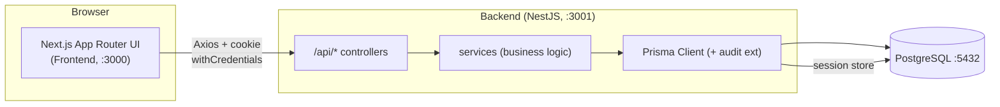
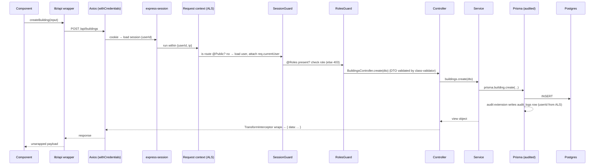
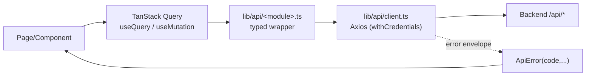
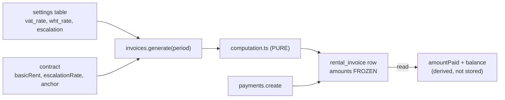
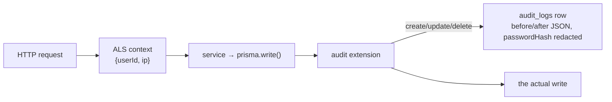
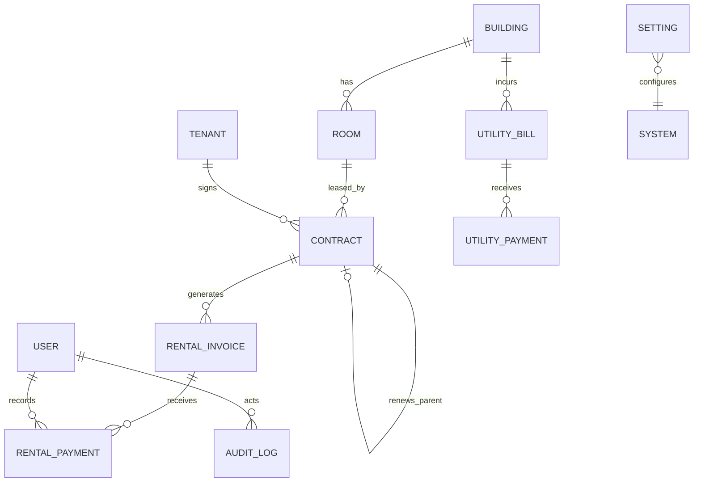

# JEFARELID System — Architecture & How It Connects

A developer's map of how the pieces fit together. Read `HANDOFF.md` for setup/run
steps, `SPEC.md` for *what* the system does, and `API-CONTRACT.md` for the exact
endpoint shapes. This file is the "how is it wired" doc.

---

## 1. Big picture

Three tiers, physically separated. They only ever talk over HTTP, defined by
`API-CONTRACT.md`. The frontend never imports backend code and vice-versa.



- **Frontend** — `Frontend/` — Next.js 16 (App Router), TypeScript, Tailwind v4,
  shadcn/ui (Base UI), TanStack Query, Axios, Recharts. Renders UI, collects
  input, calls the API. **No business math.**
- **Backend** — `Backend/src/` — NestJS 11. All logic, validation, authorization,
  computation, scheduled jobs. Port **3001**, all routes under **`/api`**.
- **Database** — `Backend/prisma/` + PostgreSQL. Schema, migrations, seed.

---

## 2. The request lifecycle (the important one)

What happens on every authenticated call, e.g. "create a building":



Key wiring points:

- **CORS + cookies** — `main.ts` enables CORS for `CORS_ORIGIN` with
  `credentials: true`; the frontend Axios instance sets `withCredentials: true`.
  That's the only reason the session cookie flows.
- **Order of middleware/guards** — `express-session` → **request-context (ALS)**
  → global `SessionGuard` → global `RolesGuard` → `ValidationPipe` → controller.
  Registered in `main.ts` and `common/common.module.ts`.
- **Envelope** — a global `TransformInterceptor` wraps success as `{ data }` (or
  `{ data, meta }` for lists); a global `AllExceptionsFilter` renders errors as
  `{ error: { code, message, details } }`. `/api/health` is the only unwrapped route.

---

## 3. Backend module map

Every domain is a NestJS module under `Backend/src/modules/<name>/`
(`*.controller.ts`, `*.service.ts`, `dto/`). Cross-cutting code is in
`Backend/src/common/`.

```
Backend/src/
├── main.ts                      bootstrap: /api prefix, CORS, session, ALS, pipes
├── app.module.ts                imports every module + ScheduleModule + ConfigModule
├── common/
│   ├── common.module.ts         @Global: provides PrismaService + PRISMA (audited),
│   │                            registers SessionGuard, RolesGuard, interceptor, filter
│   ├── prisma/
│   │   ├── prisma.service.ts    base PrismaClient (connect/disconnect)
│   │   └── prisma.tokens.ts     PRISMA token + applyAudit() → audited client
│   ├── audit/
│   │   ├── request-context.ts   AsyncLocalStorage { userId, ip }
│   │   └── audit.extension.ts   Prisma extension → writes audit_logs on write ops
│   ├── auth/                    SessionGuard, RolesGuard, @Public, @Roles, @CurrentUser
│   └── http/                    api-codes, AppException, envelope interceptor,
│                                exception filter, pagination, money serializers
└── modules/
    ├── auth/         login/logout/me/change-password (session, bcrypt, lockout)
    ├── users/        Super Admin: create/deactivate/reset-password/unlock
    ├── buildings/    CRUD (+ occupancy counts); can't delete with rooms
    ├── rooms/        nested under building; soft-delete; occupancy from active contract
    ├── tenants/      CRUD + detail (contracts, outstanding balance) + payment history
    ├── contracts/    lifecycle: draft→active→renew/terminate; overlap validation
    ├── computation/  PURE money engine (no Prisma/Nest) + unit tests
    ├── invoices/     generate (uses computation + settings), void; amounts frozen
    ├── payments/     record (overpayment/dup-OR/void guards), outstanding aging
    ├── utilities/    per-building bills + payments
    ├── settings/     Super Admin: tax/escalation rates (source of truth for rates)
    ├── dashboard/    Super Admin: aggregate queries for the charts
    ├── reports/      7 reports × json | xlsx | pdf
    └── notifications/ daily 08:00 cron + SMTP (no controller)
```

**Dependency rule:** business services inject the **audited** client via
`@Inject(PRISMA)`; `PrismaService` (base, non-audited) is used only for the
connection and inside the audit extension. That's why every request-driven write
is logged automatically — no per-service audit calls.

---

## 4. Frontend structure & how it calls the API

```
Frontend/src/
├── app/
│   ├── layout.tsx               fonts + <Providers>
│   ├── (auth)/login/            public login page
│   └── (dashboard)/
│       ├── layout.tsx           AUTH GUARD (redirect to /login) + <AppShell>
│       ├── page.tsx             "/" Overview (Admins) / redirects Super Admin → /dashboard
│       ├── dashboard/           Super Admin analytics (Recharts)
│       ├── buildings/ tenants/ contracts/ invoices/ payments/
│       ├── utilities/ reports/ audit/ settings/ users/
├── components/
│   ├── providers.tsx            QueryClientProvider + AuthProvider + Toaster
│   ├── app-shell.tsx            sidebar (nav) + header (greeting/clock/user menu)
│   ├── page-header.tsx, status-badge.tsx, confirm-dialog.tsx, ...
│   └── ui/                      shadcn components
└── lib/
    ├── api/
    │   ├── client.ts            the Axios instance + error→ApiError interceptor + unwrap()
    │   ├── types.ts             ApiError, AuthUser, ListMeta, Role
    │   └── <module>.ts          one typed wrapper file per backend module
    ├── auth/use-auth.tsx        AuthProvider (useQuery /auth/me) + useAuth()
    ├── nav.ts                   sidebar items, grouping, role gating
    └── format.ts               PHP currency + DD MMM YYYY date formatters
```

**The data path on the frontend:**



- Components **never** call Axios directly — they call a wrapper (e.g.
  `lib/api/invoices.ts`), which unwraps the `{ data }` envelope.
- Errors are normalized to an `ApiError` carrying the stable `code`; UIs switch on
  `code` (e.g. `OVERPAYMENT`, `CONTRACT_OVERLAP`), never on the message.
- Auth state is one query (`/auth/me`) exposed via `useAuth()`. The dashboard
  layout redirects to `/login` when it resolves to no user. **This is cosmetic** —
  the backend guards are the real enforcement.

---

## 5. Auth & session flow

- **Login** (`POST /api/auth/login`): verify bcrypt hash → on success set
  `session.userId`, reset lockout, `lastLoginAt`. Failures increment
  `failed_login_count`; 5 fails → `locked_until = now + 15min`.
- **Session**: stored in Postgres (`session` table, owned by Prisma), cookie is
  `httpOnly`, `sameSite=lax`, 8-hour rolling expiry. The frontend never reads it.
- **Every request** (except `@Public`): `SessionGuard` loads the user fresh and
  attaches `req.currentUser`; `@Roles('super_admin')` on a controller makes
  `RolesGuard` return **403** for anyone else — regardless of what the UI hides.
- **Logout** destroys the server session, not just the cookie.

---

## 6. Money & computation flow (the core)



- **Rates live only in `settings`** — never hardcoded. `SettingsService.getRates()`
  reads them; `invoices.generate` passes them into the pure `computation` module.
- **`computation/computation.ts` is pure** (no Prisma, no Nest): it takes numbers
  and returns numbers, uses `decimal.js`, rounds at each step. It's unit-tested
  (`computation.spec.ts`) before anything calls it.
- **Invoices freeze** their computed amounts at generation. `amountPaid` and
  `balance` are **derived on read** from payments — never stored.
- Money crosses the wire as **strings** (`"39322.50"`); the frontend only formats.

---

## 7. Audit flow



- A Prisma **client extension** (`common/audit/audit.extension.ts`) intercepts
  `create/update/delete/upsert` and writes an `audit_logs` row using the acting
  user from the ALS request context. New endpoints are audited **by default**.
- `audit_logs` is **append-only** — there is no update/delete endpoint, ever.
  Read-only view at `GET /api/audit-logs` (Super Admin).

---

## 8. Data model relationships

Defined in `Backend/prisma/schema.prisma`. Money columns are `Decimal`.



- Occupancy is **derived** from active contracts; `room.status` is a denormalized
  convenience field, never the source of truth.
- Renewals create a **new** contract row with `parent_contract_id` set; the old
  row is never mutated (set to `renewed`).

---

## 9. Configuration wiring

Everything environment-specific comes from `.env` (never hardcoded); both projects
keep a current `.env.example`.

| Value | Where set | Used by |
|---|---|---|
| `DATABASE_URL` | Backend `.env` | Prisma (app + migrations + seed + session store) |
| `PORT` (3001) | Backend `.env` | `main.ts` listen |
| `CORS_ORIGIN` | Backend `.env` | `main.ts` CORS (must match frontend origin) |
| `SESSION_SECRET` | Backend `.env` | session cookie signing |
| `SMTP_*` | Backend `.env` | notifications mail |
| `NEXT_PUBLIC_API_URL` | Frontend `.env.local` | Axios `baseURL` (must include `/api`) |

---

## 10. "Where do I change…?" cheat-sheet

- **A tax/escalation rate** → the `settings` table (UI: Settings page). Never code.
- **Add a backend endpoint** → make/extend a module under `src/modules/`; it's
  auto-audited and auto-enveloped. Add its stable error codes to `common/http/api-codes.ts`.
- **Add a frontend page** → add a route under `app/(dashboard)/`, a wrapper in
  `lib/api/`, and a nav entry in `lib/nav.ts` (with role + group).
- **Restrict to Super Admin** → `@Roles('super_admin')` on the controller (server)
  and set `roles` on the nav item (cosmetic).
- **Change the theme** → design tokens in `Frontend/src/app/globals.css`
  (`--primary`, radius, chart palette). Everything follows.
- **The WHT / escalation rule** → one place: `modules/computation/computation.ts`
  (see the `TODO: confirm with client` markers).
